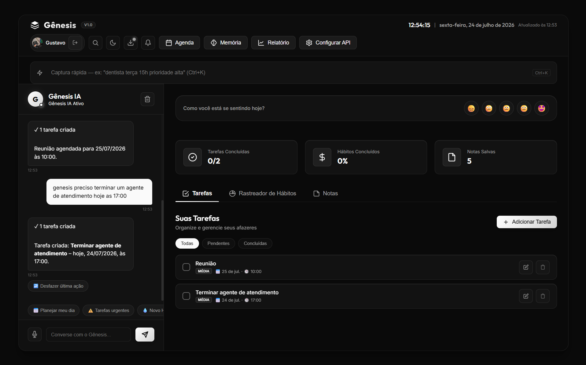
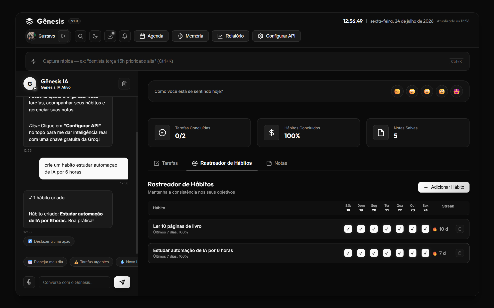

# Gênesis

Assistente pessoal de produtividade em PWA, com captura de tarefas por linguagem natural, memória persistente e roteamento entre modelos de IA por custo e complexidade.

> Projeto pessoal, desenvolvido para uso próprio e como estudo prático de arquitetura front-end, integração com LLMs e testes automatizados.

### Telas

**Tela principal — o agente criando tarefas por linguagem natural**



**Rastreador de hábitos — sequências (streaks) e criação por conversa**



---

## O problema

Aplicativos de tarefa comuns exigem que você preencha formulário: título, prioridade, data, recorrência. Na prática, isso trava o registro — a tarefa não é anotada porque dá trabalho anotar.

O Gênesis resolve isso deixando você escrever do jeito que pensa. Você digita "ligar pro dentista amanhã de manhã" e a aplicação interpreta o texto, identifica a tarefa, a data e a prioridade, e cria o registro estruturado.

---

## Funcionalidades

**Captura rápida com IA**
Interpreta texto livre e transforma em tarefa estruturada (título, prazo, horário, prioridade). Se não houver chave de API configurada, cai automaticamente para um classificador local baseado em regras — a aplicação continua funcionando sem IA.

**Roteamento entre modelos**
Tarefas simples vão para um modelo rápido e barato; tarefas que exigem raciocínio vão para um modelo mais capaz. A decisão é da aplicação, não do usuário. Isso reduz custo de inferência sem perder qualidade onde ela importa.

**Detecção de tarefas zumbi**
Identifica tarefas que foram reagendadas repetidas vezes e as separa em uma visão própria, com o motivo da sinalização. A ideia é forçar uma decisão: fazer, delegar ou descartar.

**Tarefas recorrentes**
Ao concluir uma tarefa recorrente, a próxima ocorrência é gerada automaticamente.

**Hábitos**
Acompanhamento de hábitos com grade dos últimos 7 dias, percentual de conclusão da semana e cálculo de sequência (_streak_) por hábito.

**Busca global**
Localiza tarefas em todas as visões a partir de um único campo.

**Importação e exportação**
Os dados são do usuário e podem ser levados embora a qualquer momento.

**Briefing diário proativo**
Resumo do dia exibido uma única vez, na primeira abertura, como um card discreto e dispensável. Traz uma saudação conforme o horário (bom dia / boa tarde / boa noite), destaques do dia (tarefas com prazo, sequências de hábitos e lembrete de humor quando faz sentido) e sugestões quando há tarefas atrasadas. A lógica do _que_ dizer é uma função pura, separada da camada que decide _quando_ mostrar.

---

## Decisões técnicas

**Persistência em IndexedDB, com migração automática do localStorage**
A primeira versão usava localStorage, que é síncrono e tem limite baixo de armazenamento. A migração para IndexedDB foi feita de forma transparente: na primeira abertura após a atualização, os dados antigos são lidos, gravados no novo formato e só então removidos — a exclusão só acontece depois que a cópia é verificada. Há teste automatizado cobrindo esse caminho.

**Chaves de API no cliente, nunca no repositório**
A aplicação não tem backend próprio. As chaves de IA são informadas pelo usuário e ficam no armazenamento local do navegador; nada é enviado para servidor intermediário. Nenhuma credencial real existe no código ou no histórico de commits — os testes usam chaves falsas e a configuração do Firebase vem de variáveis de ambiente.

**Degradação graciosa**
Falha de rede ou de API não quebra a aplicação. Cada funcionalidade que depende de IA tem um caminho alternativo local, e há teste cobrindo o cenário de erro da API.

**Arquitetura modular**
O projeto passou por uma refatoração que separou estado, serviços de IA, componentes de interface e persistência em módulos independentes, substituindo a estrutura monolítica inicial. A camada de agente vive isolada em `src/agent/` — é onde entram as funcionalidades novas.

---

## Stack

| Camada | Tecnologia |
|---|---|
| Build | Vite |
| Aplicação | JavaScript (ES Modules), PWA |
| Persistência | IndexedDB, localStorage |
| IA | Groq API (`gpt-oss-120b` / `gpt-oss-20b`, fallback `llama-3.3-70b`), Anthropic Claude API (modelo forte) |
| Auth / Sync | Firebase — autenticação com Google e sincronização via Firestore |
| Testes | Playwright (end-to-end) |

---

## Testes

O projeto tem cobertura end-to-end com Playwright, incluindo os caminhos que costumam quebrar em produção:

- Criação, edição e exclusão de tarefas
- Tarefas com prazo e horário, incluindo remoção do horário
- Geração da próxima ocorrência de tarefa recorrente
- Detecção e resolução de tarefas zumbi
- Migração de dados do localStorage para o IndexedDB
- Importação e exportação
- Busca global
- Captura rápida com IA e com o classificador local
- Comportamento diante de falha da API

```bash
npx playwright test
```

---

## Rodando localmente

```bash
git clone https://github.com/gustavo2807v4/projeto-agente.git
cd projeto-agente
npm install
cp .env.example .env.local   # preencha as variáveis do Firebase
npm run dev
```

As chaves das APIs de IA (Groq e Anthropic) não vão no `.env.local` — são configuradas dentro da própria aplicação, em "Configurar API". O `.env.local` guarda apenas a configuração do Firebase.

---

## Estado do projeto

Em desenvolvimento ativo. Próximo passo: infraestrutura em VPS com n8n e Evolution API para entregar o briefing diário via WhatsApp.

---

## Autor

Gustavo — Palhoça, SC
[github.com/gustavo2807v4](https://github.com/gustavo2807v4)
